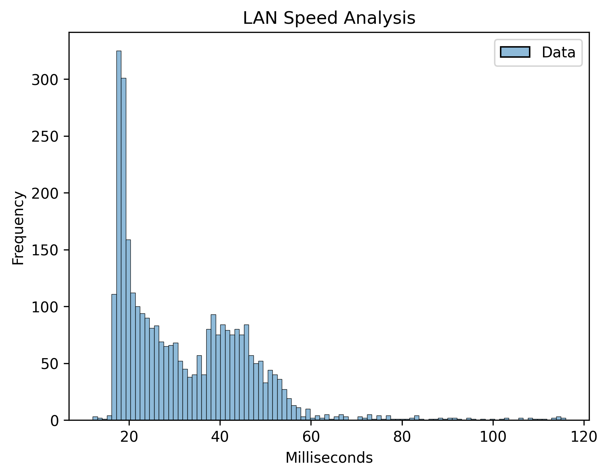

<div id="top"></div>

[![Contributors][contributors-shield]][contributors-url]
[![Forks][forks-shield]][forks-url]
[![Stargazers][stars-shield]][stars-url]
[![Issues][issues-shield]][issues-url]
[![MIT License][license-shield]][license-url]
[![LinkedIn][linkedin-shield]][linkedin-url]

<!-- PROJECT LOGO -->
<br />
<div align="center">
  <a href="https://github.com/Kaiser-bit/lan-speed">
    
  </a>

  <h3 align="center">LAN Speed</h3>

  <p align="center">
    An awesome Bash project!
    <br />
    <a href="https://github.com/Kaiser-bit/lan-speed"><strong>Explore the docs »</strong></a>
    <br />
    <br />
    <a href="https://github.com/Kaiser-bit/lan-speed">View Demo</a>
    ·
    <a href="https://github.com/Kaiser-bit/lan-speed/issues">Report Bug</a>
    ·
    <a href="https://github.com/Kaiser-bit/lan-speed/issues">Request Feature</a>
  </p>
</div>

<!-- TABLE OF CONTENTS -->
<details>
  <summary>Table of Contents</summary>
  <ol>
    <li>
      <a href="#about-the-project">About The Project</a>
      <ul>
        <li><a href="#built-with">Built With</a></li>
      </ul>
    </li>
    <li>
      <a href="#getting-started">Getting Started</a>
      <ul>
        <li><a href="#prerequisites">Prerequisites</a></li>
      </ul>
    </li>
    <li><a href="#usage">Usage</a></li>
    <li><a href="#contributing">Contributing</a></li>
    <li><a href="#license">License</a></li>
    <li><a href="#contact">Contact</a></li>
    <li><a href="#acknowledgments">Acknowledgments</a></li>
  </ol>
</details>

<!-- ABOUT THE PROJECT -->
## About The Project
<p align="center">
  
</p>

The LAN Speed project is a Bash program that allows you to visualize the communication speed between two IP addresses. It utilizes simple Linux tools, as well as the Bash and Python languages.

### Built With

* [Airodump-ng](https://www.aircrack-ng.org/doku.php?id=airodump-ng/)
* [Pandas](https://pandas.pydata.org/)
* [Scipy](https://www.scipy.org/)
* [Seaborn](https://seaborn.pydata.org/)

<!-- GETTING STARTED -->
## Getting Started

To get a local copy up and running, follow these simple steps.

### Prerequisites

Before using the software, make sure you have the following dependencies installed:
* pandas
  ```sh
  pip install pandas
  ```
* scipy
  ```sh
  pip install scipy
  ```
* matplotlib
  ```sh
  pip install matplotlib
  ```
* seaborn
  ```sh
  pip install seaborn
  ```

<!-- USAGE EXAMPLES -->
## Usage

To use the package, run it using the Bash command line:

`./lan-speed <interface> <address>`

<!-- CONTRIBUTING -->
## Contributing

Contributions are welcome and greatly appreciated. If you have a suggestion to improve the project, please fork the repository and create a pull request. You can also open an issue with the tag "enhancement". Don't forget to give the project a star! Thank you for your support!

1. Fork the Project
2. Create your Feature Branch (`git checkout -b feature/AmazingFeature`)
3. Commit your Changes (`git commit -m 'Add some AmazingFeature'`)
4. Push to the Branch (`git push origin feature/AmazingFeature`)
5. Open a Pull Request

<!-- LICENSE -->
## License

Distributed under the MIT License. See `LICENSE.md` for more information.

<!-- CONTACT -->
## Contact

Andres Caicedo - [@AndresCdo](https://twitter.com/AndresCdo) - andrezz1997@gmail.com

Project Link: [https://github.com/AndresCdo/lan-speed](https://github.com/AndresCdo/lan-speed/)

<!-- ACKNOWLEDGMENTS -->
## Acknowledgments

Here are some resources that I found helpful and would like to give credit to. I've included a few of my favorites to kick things off!

* [Choose an Open Source License](https://choosealicense.com)
* [Img Shields](https://shields.io)
* [Font Awesome](https://fontawesome.com)

<p align="right">(<a href="#top">back to top</a>)</p>


<!-- MARKDOWN LINKS & IMAGES -->
<!-- https://www.markdownguide.org/basic-syntax/#reference-style-links -->
[contributors-shield]: https://img.shields.io/github/contributors/Kaiser-bit/lan-speed.svg?style=for-the-badge
[contributors-url]: https://github.com/Kaiser-bit/lan-speed/graphs/contributors
[forks-shield]: https://img.shields.io/github/forks/Kaiser-bit/lan-speed.svg?style=for-the-badge
[forks-url]: https://github.com/Kaiser-bit/lan-speed/network/members
[stars-shield]: https://img.shields.io/github/stars/Kaiser-bit/lan-speed.svg?style=for-the-badge
[stars-url]: https://github.com/Kaiser-bit/lan-speed/stargazers
[issues-shield]: https://img.shields.io/github/issues/Kaiser-bit/lan-speed.svg?style=for-the-badge
[issues-url]: https://github.com/Kaiser-bit/lan-speed/issues
[license-shield]: https://img.shields.io/github/license/Kaiser-bit/lan-speed.svg?style=for-the-badge
[license-url]: https://github.com/Kaiser-bit/lan-speed/blob/master/LICENSE.md
[linkedin-shield]: https://img.shields.io/badge/-LinkedIn-black.svg?style=for-the-badge&logo=linkedin&colorB=555
[linkedin-url]: https://www.linkedin.com/i
